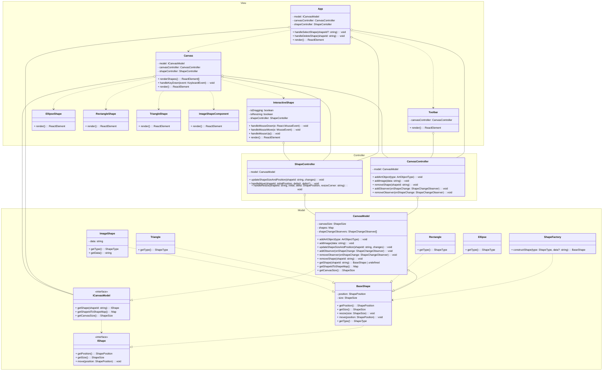

```mermaid
classDiagram

ShapeFactory ..> BaseShape
CanvasModel o-- BaseShape
CanvasModel ..|> ICanvasModel
BaseShape ..|> IShape
Ellipse ..|> BaseShape
Rectangle ..|> BaseShape
Triangle ..|> BaseShape
ImageShape ..|> BaseShape
ICanvasModel ..> IShape
namespace Model {
    class ShapeFactory {
        + constructShape(type: ShapeType, data?: string): BaseShape
    }

    class ICanvasModel {
        <<interface>>
        + getShape(shapeId: string): IShape
        + getShapeIdToShapeMap(): Map<string, IShape>
        + getCanvasSize(): ShapeSize
    }

    class CanvasModel {
        - canvasSize: ShapeSize
        - shapes: Map<string, BaseShape>
        - shapeChangeObservers: ShapeChangeObserver[]
        + addArtObject(type: ArtObjectType): void
        + addImage(data: string): void
        + updateShapeSizeAndPosition(shapeId: string, changes): void
        + addObserver(onShapeChange: ShapeChangeObserver): void
        + removeObserver(onShapeChange: ShapeChangeObserver): void
        + removeShape(shapeId: string): void
        + getShape(shapeId: string): BaseShape | undefined
        + getShapeIdToShapeMap(): Map<string, BaseShape>
        + getCanvasSize(): ShapeSize
    }

    class IShape {
        <<interface>>
        + getPosition(): ShapePosition
        + getSize(): ShapeSize
        + move(position: ShapePosition): void
    }

    class BaseShape {
        - position: ShapePosition
        - size: ShapeSize
        + getPosition(): ShapePosition
        + getSize(): ShapeSize
        + resize(size: ShapeSize): void
        + move(position: ShapePosition): void
        + getType()*: ShapeType
    }

    class Ellipse {
        + getType(): ShapeType
    }

    class Rectangle {
        + getType(): ShapeType
    }

    class Triangle {
        + getType(): ShapeType
    }

    class ImageShape {
        - data: string
        + getType(): ShapeType
        + getData(): string
    }
}

App o-- ICanvasModel
App o-- CanvasController
App o-- ShapeController
App ..> Canvas
App ..> Toolbar
Toolbar o-- CanvasController
Canvas o-- ICanvasModel
Canvas o-- ShapeController
Canvas o-- CanvasController
Canvas ..> InteractiveShape
Canvas ..> EllipseShape
Canvas ..> RectangleShape
Canvas ..> TriangleShape
Canvas ..> ImageShapeComponent
InteractiveShape o-- ShapeController
namespace View {
    class App {
        - model: ICanvasModel
        - canvasController: CanvasController
        - shapeController: ShapeContoller
        + handleSelectShape(shapeId?: string): void
        + handleDeleteShape(shapeId: string): void
        + render(): ReactElement
    }

    class Canvas {
        - model: ICanvasModel
        - canvasController: CanvasController
        - shapeController: ShapeController
        + renderShapes(): ReactElement[]
        + handleKeyDown(event: KeyboardEvent): void
        + render(): ReactElement
    }

    class Toolbar {
        - canvasController: CanvasController
        + render(): ReactElement
    }

    class InteractiveShape {
        - isDragging: boolean
        - isResizing: boolean
        - shapeController: ShapeContoller
        + handleMouseDown(e: React.MouseEvent): void
        + handleMouseMove(e: MouseEvent): void
        + handleMouseUp(): void
        + render(): ReactElement
    }

    class EllipseShape {
        + render(): ReactElement
    }

    class TriangleShape {
        + render(): ReactElement
    }

    class RectangleShape {
        + render(): ReactElement
    }

    class ImageShapeComponent {
        + render(): ReactElement
    }
}

CanvasController o-- CanvasModel
ShapeController o-- CanvasModel
namespace Controller {
    class CanvasController {
        - model: CanvasModel
        + addArtObject(type: ArtObjectType): void
        + addImage(data: string): void
        + removeShape(shapeId: string): void
        + addObserver(onShapeChange: ShapeChangeObserver): void
        + removeObserver(onShapeChange: ShapeChangeObserver): void
    }

    class ShapeController {
        - model: CanvasModel
        + updateShapeSizeAndPosition(shapeId: string, changes): void
        + handleMove(shapeId, initialPosition, deltaX, deltaY): void
        + handleResize(shapeId: string, initial, delta: ShapePosition, resizeCorner: string): void
    }
}
```
