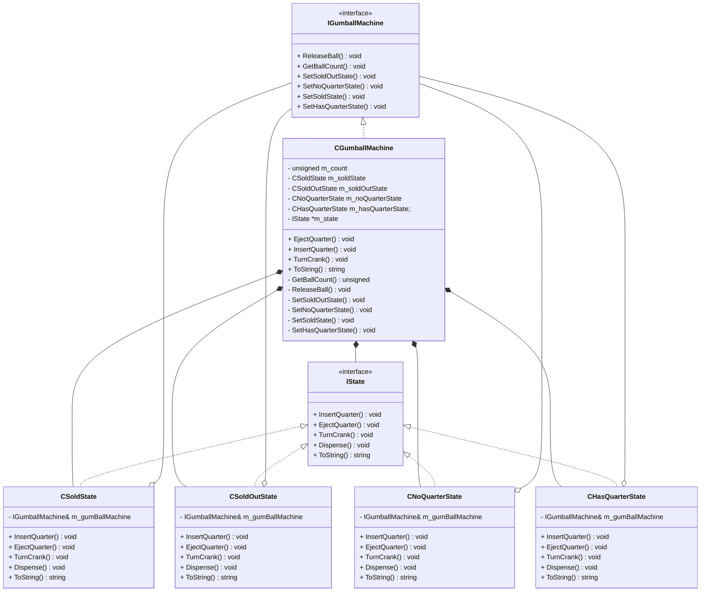
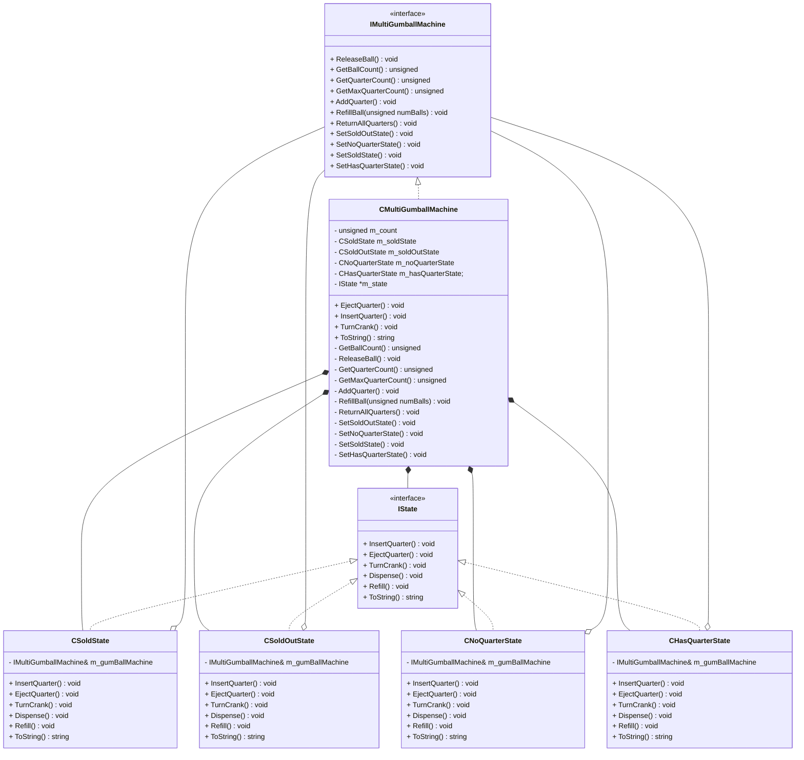

gumball_machine

```mermaid
classDiagram

class IGumballMachine {
    <<interface>>
    + ReleaseBall() void
    + GetBallCount() void
    + SetSoldOutState() void
    + SetNoQuarterState() void
    + SetSoldState() void
    + SetHasQuarterState() void
}

IGumballMachine <|.. CGumballMachine
CGumballMachine *-- CSoldState
CGumballMachine *-- CSoldOutState
CGumballMachine *-- CNoQuarterState
CGumballMachine *-- CHasQuarterState
CGumballMachine *-- IState
class CGumballMachine {
    + EjectQuarter() void
    + InsertQuarter() void
    + TurnCrank() void
    + ToString() string
    - GetBallCount() unsigned
    - ReleaseBall() void
    - SetSoldOutState() void
    - SetNoQuarterState() void
    - SetSoldState() void
    - SetHasQuarterState() void
    - unsigned m_count
    - CSoldState m_soldState
	- CSoldOutState m_soldOutState
	- CNoQuarterState m_noQuarterState
	- CHasQuarterState m_hasQuarterState;
	- IState *m_state
}

class IState {
    <<interface>>
    + InsertQuarter() void
    + EjectQuarter() void
    + TurnCrank() void
    + Dispense() void
    + ToString() string
}

IState <|.. CHasQuarterState
CHasQuarterState o-- IGumballMachine
class CHasQuarterState {
    + InsertQuarter() void
    + EjectQuarter() void
    + TurnCrank() void
    + Dispense() void
    + ToString() string
    - IGumballMachine& m_gumBallMachine
}

IState <|.. CNoQuarterState
CNoQuarterState o-- IGumballMachine
class CNoQuarterState {
    + InsertQuarter() void
    + EjectQuarter() void
    + TurnCrank() void
    + Dispense() void
    + ToString() string
    - IGumballMachine& m_gumBallMachine
}

IState <|.. CSoldOutState
CSoldOutState o-- IGumballMachine
class CSoldOutState {
    + InsertQuarter() void
    + EjectQuarter() void
    + TurnCrank() void
    + Dispense() void
    + ToString() string
    - IGumballMachine& m_gumBallMachine
}

IState <|.. CSoldState
CSoldState o-- IGumballMachine
class CSoldState {
    + InsertQuarter() void
    + EjectQuarter() void
    + TurnCrank() void
    + Dispense() void
    + ToString() string
    - IGumballMachine& m_gumBallMachine
}
```

multi_gumball_machine

```mermaid
classDiagram
class IMultiGumballMachine {
    <<interface>>
    + ReleaseBall() void
    + GetBallCount() unsigned
    + GetQuarterCount() unsigned
    + GetMaxQuarterCount() unsigned
    + AddQuarter() void
    + RefillBall(unsigned numBalls) void
    + ReturnAllQuarters() void
    + SetSoldOutState() void
    + SetNoQuarterState() void
    + SetSoldState() void
    + SetHasQuarterState() void
}

IMultiGumballMachine <|.. CMultiGumballMachine
CMultiGumballMachine *-- CSoldState
CMultiGumballMachine *-- CSoldOutState
CMultiGumballMachine *-- CNoQuarterState
CMultiGumballMachine *-- CHasQuarterState
CMultiGumballMachine *-- IState
class CMultiGumballMachine {
    + EjectQuarter() void
    + InsertQuarter() void
    + TurnCrank() void
    + ToString() string
    - GetBallCount() unsigned
    - ReleaseBall() void
    - GetQuarterCount() unsigned
    - GetMaxQuarterCount() unsigned
    - AddQuarter() void
    - RefillBall(unsigned numBalls) void
    - ReturnAllQuarters() void
    - SetSoldOutState() void
    - SetNoQuarterState() void
    - SetSoldState() void
    - SetHasQuarterState() void
    - unsigned m_count
    - CSoldState m_soldState
    - CSoldOutState m_soldOutState
    - CNoQuarterState m_noQuarterState
    - CHasQuarterState m_hasQuarterState;
    - IState *m_state
}

class IState {
    <<interface>>
    + InsertQuarter() void
    + EjectQuarter() void
    + TurnCrank() void
    + Dispense() void
    + Refill() void
    + ToString() string
}

IState <|.. CHasQuarterState
CHasQuarterState o-- IMultiGumballMachine
class CHasQuarterState {
    + InsertQuarter() void
    + EjectQuarter() void
    + TurnCrank() void
    + Dispense() void
    + Refill() void
    + ToString() string
    - IMultiGumballMachine& m_gumBallMachine
}

IState <|.. CNoQuarterState
CNoQuarterState o-- IMultiGumballMachine
class CNoQuarterState {
    + InsertQuarter() void
    + EjectQuarter() void
    + TurnCrank() void
    + Dispense() void
    + Refill() void
    + ToString() string
    - IMultiGumballMachine& m_gumBallMachine
}

IState <|.. CSoldOutState
CSoldOutState o-- IMultiGumballMachine
class CSoldOutState {
    + InsertQuarter() void
    + EjectQuarter() void
    + TurnCrank() void
    + Dispense() void
    + Refill() void
    + ToString() string
    - IMultiGumballMachine& m_gumBallMachine
}

IState <|.. CSoldState
CSoldState o-- IMultiGumballMachine
class CSoldState {
    + InsertQuarter() void
    + EjectQuarter() void
    + TurnCrank() void
    + Dispense() void
    + Refill() void
    + ToString() string
    - IMultiGumballMachine& m_gumBallMachine
}
```