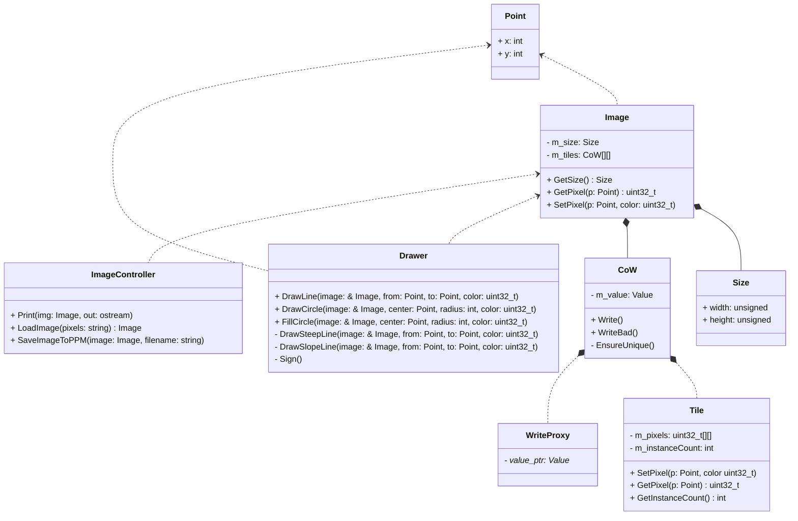

```mermaid
classDiagram
Image <.. ImageController
class ImageController {
    + Print(img: Image, out: ostream)
    + LoadImage(pixels: string) Image
    + SaveImageToPPM(image: Image, filename: string)
}

Image <.. Drawer
Point <.. Drawer
class Drawer {
    + DrawLine(image: & Image, from: Point, to: Point, color: uint32_t)
    + DrawCircle(image: & Image, center: Point, radius: int, color: uint32_t)
    + FillCircle(image: & Image, center: Point, radius: int, color: uint32_t)
    - DrawSteepLine(image: & Image, from: Point, to: Point, color: uint32_t)
    - DrawSlopeLine(image: & Image, from: Point, to: Point, color: uint32_t)
    - Sign()
}

class WriteProxy {
    - value_ptr: Value*
}

CoW *.. WriteProxy
CoW *.. Tile
class CoW {
    + Write()
    + WriteBad()
    - m_value: Value
    - EnsureUnique()
}

Point <.. Image
Image *-- CoW
Image *-- Size
class Image {
    + GetSize() Size
    + GetPixel(p: Point) uint32_t
    + SetPixel(p: Point, color: uint32_t)
    - m_size: Size
    - m_tiles: CoW<Tile>[][]
}

class Tile {
    + SetPixel(p: Point, color uint32_t)
    + GetPixel(p: Point) uint32_t
    + GetInstanceCount() int
    - m_pixels: uint32_t[][]
    - m_instanceCount: int
}

class Point {
    + x: int
    + y: int
}

class Size {
    + width: unsigned
    + height: unsigned
}
```